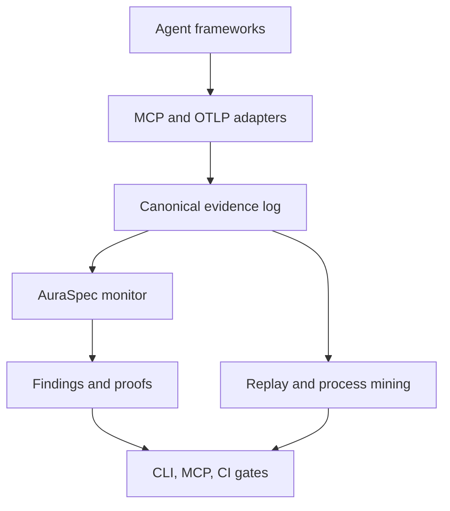

# Aura Runtime architecture

## Product boundary

Aura is a verification runtime, not a general observability backend. Existing telemetry
systems remain the source for performance analysis. Aura consumes their signals, adds
protocol-native events, and preserves enough evidence to replay a run deterministically.

## Invariants

1. Adapters never define policy semantics; they only normalize evidence.
2. Every finding refers to immutable event IDs.
3. Policy evaluation is deterministic and does not require an LLM.
4. Model-generated explanations may be added later, but never decide compliance.
5. OpenTelemetry is an import/export contract, not Aura's primary event database.

## Modules

| Module | Responsibility |
|---|---|
| `models` | Canonical events, qualified business-object links, and findings |
| `store` | SQLite WAL evidence and finding storage |
| `policy` | AuraSpec schema, selectors, and YAML loading |
| `verifier` | Online past/future temporal monitors and Z3-backed data constraints |
| `ltlf` | LTLf parser, exact formula progression, and four-valued prefix semantics |
| `alphabet` | Conservative event-selector feasibility theory for Boolean valuations |
| `valuation` | Solver-neutral valuation-space protocol and explicit reference backend |
| `strategy_backend` | Replaceable finite-trace game-solving protocol and reference solver |
| `partial_observation` | Belief-state synthesis with hidden inputs universally quantified |
| `adapters.mcp` | MCP JSON-RPC normalization and correlation |
| `adapters.otel` | OTLP/JSON span normalization |
| `flight` | Hash-chained MCP transcript and policy decisions |
| `proxy` | Transparent MCP stdio process boundary |
| `replay` | Read-only policy replay and behavioral comparison |
| `contract` | CI regression verdicts over committed baselines |
| `mcp_server` | Agent-accessible status and finding tools |
| `ocel_export` | Privacy-safe OCEL 2.0 object-centric exchange |
| `object_process` | Object-centric lifecycle discovery and structural drift |
| `object_contract` | Content-addressed lifecycle contracts and online object state |
| `cli` | Local ingestion, verification, and reports |

## Near-term design

The alpha evaluates bounded-history prerequisites, bounded future-response obligations,
and general LTLf formulas online. Future obligations remain pending while a response is still possible, become
satisfied when a matching event arrives, and become violated at the earliest deadline or
when the trace is explicitly finalized. LTLf residual formulas provide exact four-valued
prefix semantics and finite-trace pass/fail finalization. SQLite is the local default; a
storage protocol will allow Postgres or an immutable object store without changing
verification semantics.

## Flight-recorder decision boundary

`observe` mode records findings but forwards every valid MCP message. `enforce` mode
intercepts a violating `tools/call` request and returns a namespaced JSON-RPC error without
starting the upstream side effect. Policy effects distinguish unconditional denial from
approval-required decisions. The transcript records both the blocked request and the
synthetic response, preserving an auditable explanation of what did not execute.

Object-contract enforcement is transactional at this boundary. Aura binds object identities
from the canonical event, assesses the proposed transition, and commits it to accepted state
only if the request is forwarded. Reports replace raw identities with contract-scoped SHA-256
pseudonyms. The contract hash detects content changes; it is not an author signature.

LTLf shielding is control-aware at the same boundary. Agent propositions may be changed in
repair alternatives; environment and observation-only propositions remain fixed. Unspecified
ownership is observation-only. This prevents a logical counterfactual, such as changing a
human approval fact, from being presented as an executable agent action.

Offline strategy checking expands reachable residual formulas into a two-player game.
Before expansion, the event alphabet removes valuations that cannot describe one canonical
event, such as two different event kinds or contradictory exact payload values. The theory
is injected through a valuation-space protocol. The Aura alphabet uses Z3 to generate
feasible models directly; the explicit implementation remains a differential-test oracle.
Unknown glob relationships remain feasible. A separate strategy-backend protocol keeps
future BDD, SDD, or DPLL game solvers independent from LTLf syntax and report contracts.
Accepting residuals form rank zero; the controller winning region is the least fixpoint of
states with an agent valuation whose every environment successor has a lower winning rank.
The solver is exact within explicit atom and state limits and never falls back to an
approximate realizability verdict.

Runtime strategy reports also construct one joint game for the conjunction of all configured
LTLf policies. Equivalent selectors are unified across policies, and conflicting ownership is
resolved away from agent control. The aggregate `all_realizable` verdict therefore means the
entire contract bundle is jointly realizable, not merely that each rule passes in isolation.

Visibility is independent from control ownership. Hidden environment propositions are never
included in counterstrategy content. Aura progresses every residual consistent with the same
observable history into one belief state, so an accepted controller action must work for all
hidden valuations rather than depending on inaccessible runtime facts.

## Replay identity

Replay does not compare regenerated finding IDs or timestamps. A finding's deterministic
identity is its policy, evidence event, severity, message, and verification engine. Run
comparison similarly removes run IDs, event IDs, timestamps, sequence counters, and trace
identifiers before alignment. Protocol-scoped request, session, and tool-call IDs are also
removed from event payloads. Tool manifests are compared by canonical JSON content.

These normalization rules are deliberately narrow: tool arguments and results remain part
of behavioral identity, so a changed value produces a divergence. Replay only reads the
evidence store and never launches a process, calls a tool, or appends new findings.

## Trace contracts

A trace contract binds an AuraSpec policy, baseline event fixture, baseline MCP manifest,
and allow/deny rules. Candidate evidence remains in its own SQLite store. Contract checking
normalizes execution-scoped identity, evaluates both event streams under the same policy,
and produces one verdict from three independent signals: new findings, event divergence,
and tool-manifest drift.

The contract engine itself is read-only. Scenario execution is a separate CI step through
the flight recorder, which keeps capture and judgment independently testable.
