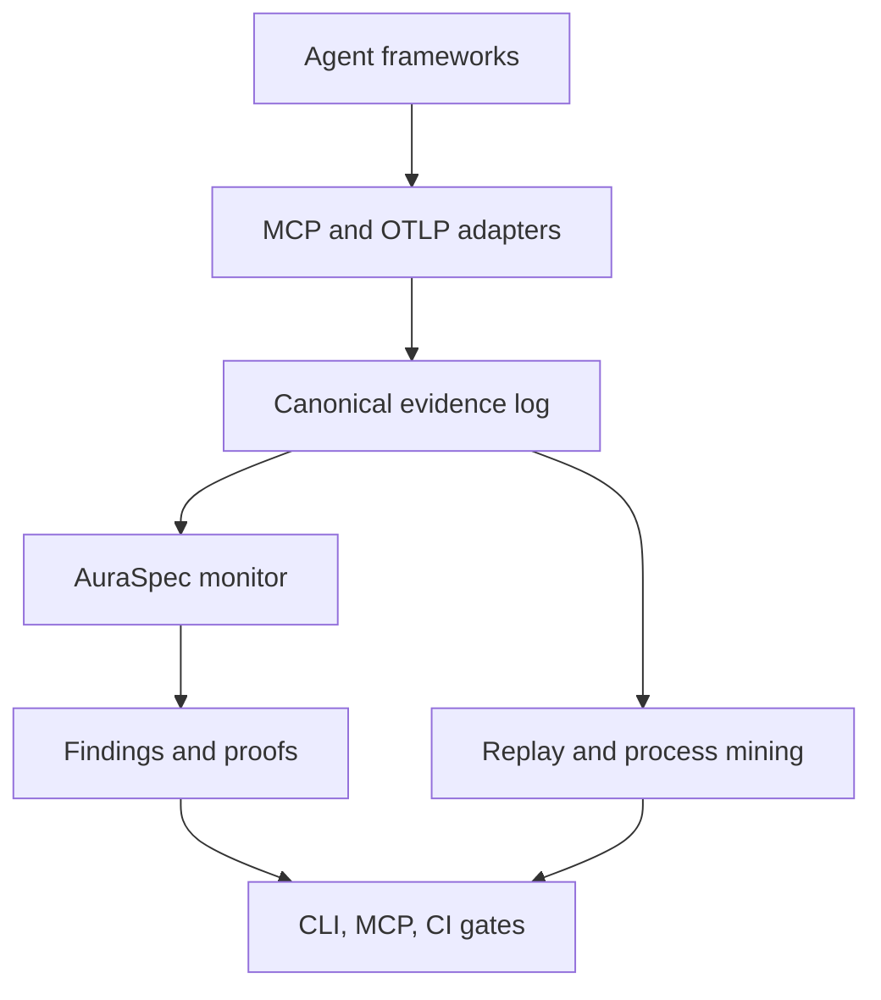

# Aura Runtime architecture

## Product boundary

Aura is a verification runtime, not a general observability backend. Existing telemetry
systems remain the source for performance analysis. Aura consumes their signals, adds
protocol-native events, and preserves enough evidence to replay a run deterministically.

## Invariants

1. Adapters never define policy semantics; they only normalize evidence.
2. Every finding refers to immutable event IDs.
3. Policy evaluation is deterministic and does not require an LLM.
4. Model-generated explanations may be added later, but never decide compliance.
5. OpenTelemetry is an import/export contract, not Aura's primary event database.

## Modules

| Module | Responsibility |
|---|---|
| `models` | Canonical events and findings |
| `store` | SQLite WAL evidence and finding storage |
| `policy` | AuraSpec schema, selectors, and YAML loading |
| `verifier` | Temporal checks and Z3-backed data constraints |
| `adapters.mcp` | MCP JSON-RPC normalization and correlation |
| `adapters.otel` | OTLP/JSON span normalization |
| `mcp_server` | Agent-accessible status and finding tools |
| `cli` | Local ingestion, verification, and reports |

## Near-term design

The alpha evaluates bounded-history prerequisites online. The interface is intentionally
compatible with compiling richer temporal clauses into finite-state monitors. SQLite is
the local default; a storage protocol will allow Postgres or an immutable object store
without changing verification semantics.

